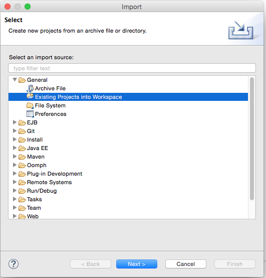
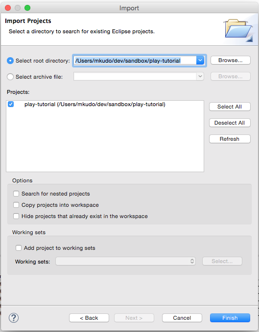
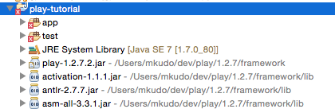
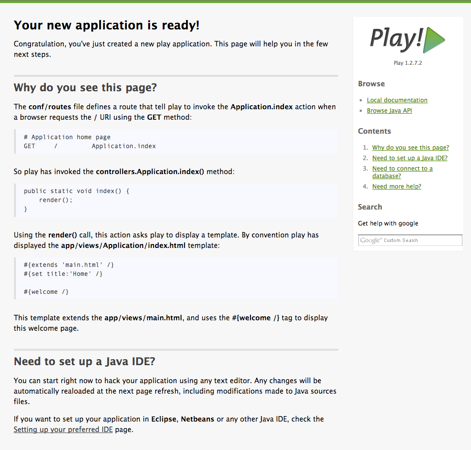

# アプリケーションを作成する

## アプリケーションの雛形を作成する

`play new` コマンドでアプリケーションの雛形を作成します。
ここでは `play-tutorial` という名称のアプリケーションを作成します。

```
$ play new play-tutorial
~        _            _
~  _ __ | | __ _ _  _| |
~ | '_ \| |/ _' | || |_|
~ |  __/|_|\____|\__ (_)
~ |_|            |__/
~
~ play! 1.2.7.2, http://www.playframework.org
~
~ The new application will be created in /path-to-path/play-tutorial
~ What is the application name? [play-tutorial]
~
~ OK, the application is created.
~ Start it with : play run play-tutorial
~ Have fun!
~
```

成功すると以下の構成のディレクトリが作成されます。

```
app/
    controllers/          # Controller クラスを配置する
        Application.java
    models/               # Models クラスを配置する
    views/                # テンプレートファイルを配置する
        Application/
            index.html
        errors/           # HTTPステータスコード毎のエラーページ
            404.html
            500.html
        main.html

conf/
    application.conf      # アプリケーション設定ファイル
    dependencies.yml      # モジュール、ライブラリ、アプリケーションの依存設定ファイル
    messages              # 国際化対応用のメッセージファイル
    routes                # URLとコントローラのルーティングファイル

lib/                      # 依存ライブラリが配置される       

public/                   # 静的ファイルを配置する

test/                     # テストクラスを配置する  

tmp/                      # Play! が生成するバイトコードの配置先、添付ファイルの一時ファイルの配置先、等

```

## アプリケーションを Eclipse プロジェクトとしてインポートする

### Eclipse プロジェクトに変換する

`play eclipsify` コマンドを使って、作成したアプリケーションのディレクトリを Eclipse プロジェクトに変換します。

```
$ play eclipsify
~        _            _
~  _ __ | | __ _ _  _| |
~ | '_ \| |/ _' | || |_|
~ |  __/|_|\____|\__ (_)
~ |_|            |__/
~
~ play! 1.2.7.2, http://www.playframework.org
~
~ OK, the application "play-tutorial" is ready for eclipse
~ Use File/Import/General/Existing project to import /Users/mkudo/dev/sandbox/play-tutorial into eclipse
~
~ Use eclipsify again when you want to update eclipse configuration files.
~ However, it's often better to delete and re-import the project into your workspace since eclipse keeps dirty caches...
```

成功すると、Eclipse 用の設定ファイル `.project` や `.settings`、eclipse ディレクトリ等が生成されます。

### Eclipse にプロジェクトをインポートする



Eclipse の [File]-[Import...] を選択し、[General]-[Existing Projects into Workspace] を選択して「Next > 」ボタンをクリックします。



[Select root directory] にアプリケーションのディレクトリ指定します。
すると [Projects] 配下に `play-tutorial` が表示されるので、選択して「Finish」ボタンをクリックします。

成功すると Project Explorer 上に `play-tutorial` が表示されます。



Eclipse の設定によっては、play-tutorial プロジェクトに赤いマークが表示されているかもしれません。
この場合は [Project]-[Clean...] より一度再ビルドを行ってみてください。

### アプリケーションを起動する

Eclipse 上から、`play-tutorial/eclipse/play-tutorial.launch` を選択し、[右クリック]-[Run As]-[play-tutorial] を選択します。
起動に成功すると、Eclipse コンソールに以下のメッセージが表示されます。

```
Listening for transport dt_socket at address: 8000
16:05:53,142 INFO  ~ Starting /Users/mkudo/dev/sandbox/play-tutorial
16:05:53,659 WARN  ~ You're running Play! in DEV mode
16:05:53,747 INFO  ~ Listening for HTTP on port 9000 (Waiting a first request to start) ...
~ Server is up and running
```

ブラウザを開き、http://localhost:9000/ にアクセスすると以下のページが表示されます。


