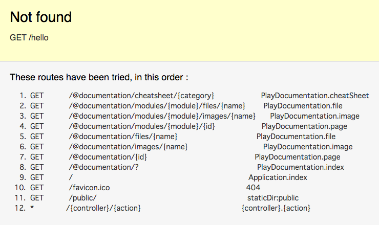
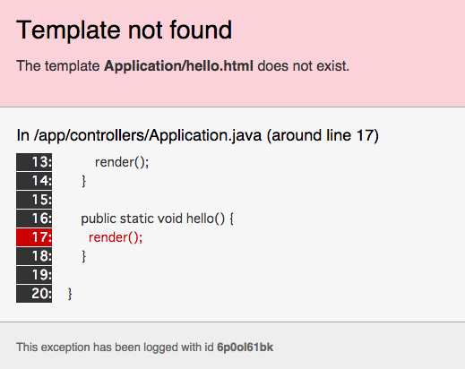

# アプリケーションにページを追加する

作成したアプリケーションに、新たに `http://localhost:9000/hello` という URL に対応したページを作成する流れを説明します。

## コントローラを追加する

`app/controllers/Application.java` を開き、hello メソッドを追加します。
この時、メソッドが static であることに注意してください。

```java
package controllers;

import play.*;
import play.mvc.*;

import java.util.*;

import models.*;

public class Application extends Controller {

    public static void index() {
        render();
    }

    public static void hello() {
    	render();
    }

}
```

この状態でブラウザでアクセスしてみると、以下のエラー画面が表示されます。
これはルーティング設定の中に /hello が含まれていないことを意味しています。



## ルーティングの設定を追加する

`conf/routes` を開き、/hello に対応した設定を追加します。

```
# Routes
# This file defines all application routes (Higher priority routes first)
# ~~~~

# Home page
GET     /                                       Application.index

# Ignore favicon requests
GET     /favicon.ico                            404

# Map static resources from the /app/public folder to the /public path
GET     /public/                                staticDir:public

# Catch all
*       /{controller}/{action}                  {controller}.{action}

GET     /hello                                  Application.hello
```

再度アクセスすると、今度は以下のエラーが表示されます。
これは /hello に対応したテンプレートファイルが存在しないことを意味しています。



## テンプレートファイルを追加する

`app/views/Application/` 配下に hello.html を追加します。

```
#{extends 'main.html' /}
#{set title:'Hello' /}

Hello, World!
```

再度アクセスすると、無事ページが表示されます。
