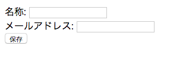
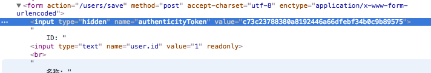

# 登録画面を追加する

これまで説明した内容を元に、登録画面を追加してみましょう。
サンプルとして、ユーザーを登録する簡単な画面を追加します。

## DB 設定を行う

モデルの保存処理を行うので、`application.conf` に DB の設定を追加します。
今回はサンプルなので、インメモリ DB を利用します。

```application.conf
db=mem
```

## モデルを追加する

`app/models` 配下にユーザーを表すモデルクラス `User` を追加します。

```java
@Entity
public class User extends Model {

    public String name;

    public String email;

}
```

## 登録画面を追加する

次にコントローラ `Users` を追加します。
登録画面を表示するメソッド `show` と、保存するメソッド `save` を追加します。

```java
public class Users extends Controller {

    /** 登録画面を表示する */
    public static void show(Long id) {
        User user = null;
        if (id == null) {
            user = new User();
        } else {
            user = User.findById(id);
        }

        render(user);
    }

    /** 保存処理 */
    public static void save(User user) {
        validation.required(user.name);
        validation.required(user.email);

        if (!validation.hasErrors()) {
            user.save();

            show(user.id);
        } else {
            render("@show", user);
        }
    }

}
```

続けてテンプレート `app/views/Users/show.html` を追加します。
エラー情報が返却されている場合はエラーメッセージを表示するようにします。

```
#{ifErrors}
   <h4>保存時にエラーが発生しました</h4>
#{/ifErrors}

<form action="@{save()}" method="POST">
    ID: <input type="text" name="user.id" value="${user.id}" readonly><br>
    名称: <input type="text" name="user.name" value="${user.name}"><br>
    メールアドレス: <input type="text" name="user.email" value="${user.email}"><br>

    <input type="submit" value="保存">
</form>
```

ブラウザで `/users/show` にアクセスすると、以下の画面が表示されます。
実際にデータが登録されること、必須チェックが動作することを確認してください。



## フォームの CSRF 対策

一般的なフォーム画面では、CSRF (クロスサイトリクエストフォージェリ) という脆弱性に対する対策を実装する必要があります。
対策されていない場合、この脆弱性を突いた攻撃が行われた場合に、ユーザーが意図しない投稿処理が走ってしまう事になります。

> クロスサイトリクエストフォージェリ（CSRF）とは、Webアプリケーションに存在する脆弱性、もしくはその脆弱性を利用し> た攻撃方法のことです。 掲示板や問い合わせフォームなどを処理するWebアプリケーションが、本来拒否すべき他サイトからのリクエストを受信し処理してしまいます

一般的な対策方法としては、CSRF トークンという一時トークンを投稿画面アクセス時に発行し、
投稿処理にそのトークンを渡すことで、想定された画面から処理が行われたかどうかを判別する、という手法を取ります。


Play! では `#{form}` タグを使うことで簡単に CSRF トークンを発行することが可能です。
先ほどのテンプレートファイルの `<form>` 要素を `#{form}` タグに置き換えます。

```html
#{form @save()}
    ...
#{/form}
```

ブラウザで `/users/show` にアクセスして HTML の中身を確認すると、`authenticityToken` という hidden フィールドが自動的に追加されていることが確認できます。
これが CSRF トークンです。



次にコントローラ側に CSRF トークンチェックを行うよう処理を追記します。

```java
    public static void save(User user) {
        checkAuthenticity();
        ...
    }
```

試しにテンプレート側の実装を `<form>` 要素に戻して保存してみると、403 Forbidden エラーが発生します。
